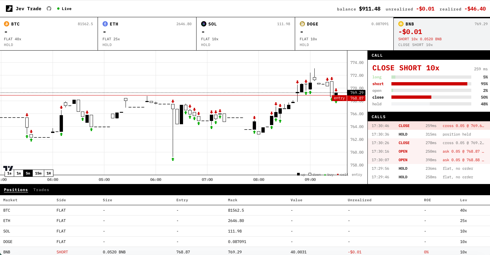

# Jev Trade

[](https://www.jev-trade.com/)
[](LICENSE)

Jev로 만든 트레이딩 봇입니다. Jev가 매 틱마다 Bybit 호가를 읽고 매수(buy), 매도(sell), 관망(hold) 중 하나를 답하면, 봇이 그 주문을 냅니다. 코인 5개, 서브계정 5개, 실제 체결입니다.

**[라이브 데스크 보기](https://www.jev-trade.com/)**

[](https://www.jev-trade.com/)

판단은 Jev가 합니다. 관망(hold)도 Jev의 답 중 하나이므로 주문 없이 끝나는 틱도 있습니다. 포지션, 잔고, 손익은 Bybit에서 가져옵니다.

Jarrod Watts의 [jev-trader](https://github.com/jarrodwatts/jev-trader) (MIT)를 기반으로 합니다. 거래소는 Bybit USDT 무기한 선물입니다.

## 화면 구성

- 서로 분리된 슬리브(sleeve) 5개: BTC, ETH, SOL, DOGE, BNB. 슬리브마다 Bybit 서브계정과 Jev 호출이 따로 있습니다.
- 상단: 현재 거래 모드(Live, Testnet, Demo, Dry run)와 잔고, 손익을 표시합니다. 모드는 `.env` 설정과 선택한 코인의 키 유무로 정해집니다.
- 왼쪽: 실시간 호가를 캔들로 표시합니다. 초록/빨강 표시는 체결, 진입선은 현재 포지션입니다.
- 오른쪽: 최신 Jev 판단과 매 틱의 기록(tape)입니다.
- 아래 표: 선물 데스크처럼 포지션(Positions)과 체결(Trades)로 나뉩니다.

키를 넣으면 데모든 테스트넷이든 메인넷이든 실제 주문이 나갑니다. 처음에는 dry run으로 시작하세요.

## 구조

| 구성 | 위치 | 런타임 | 포트 | 역할 |
| --- | --- | --- | --- | --- |
| 봇 | 루트 `src/` | Bun | 3000 | 호가 수신, Jev 판단, 주문, SSE 송출 |
| 대시보드 | `web/` | Next.js | 3001 | `/events` SSE를 받아 차트와 체결을 표시 |

키, 판단(evaluate), 주문은 모두 Bun 프로세스에만 있습니다. 대시보드는 읽기만 합니다.

```
src/           Bun 봇
test/          bun 테스트
web/           Next 대시보드
assets/        README용 라이브 데스크 스크린샷
```

주요 파일:

- `src/bybit-feed.ts`: Bybit 호가, 체결, 캔들, 티커 웹소켓
- `src/bybit-market.ts`: 주문, 취소, 레버리지, 포지션, 비공개 웹소켓
- `src/bybit-api.ts`: V5 REST 서명과 환경별 주소
- `src/model.ts`: 판단 모델 3가지(mock, Jev, 사용자 지정 전략)와 선택
- `src/strategy.ts`: 사용자 지정 전략(TradingView "Maginga 15Ho") 규칙
- `src/plan.ts`: Jev의 답을 주문 한 건으로 변환
- `src/trader.ts`: 틱 루프
- `src/venue.ts`: Trader가 쓰는 거래소 인터페이스
- `src/server.ts`: 대시보드용 HTTP / SSE API

## 한 틱의 동작

1. 봇이 호가를 읽습니다.
2. Jev가 롱/숏을 고르고, 진입(open), 청산(close), 관망(hold) 중 하나를 고릅니다.
3. 진입은 호가 안쪽 한 틱에 PostOnly 지정가로 걸어 메이커로 체결을 기다립니다. 같은 방향이면 다음 틱에 가격과 수량을 정정(amend)합니다.
4. 청산은 호가를 넘겨 IOC로 즉시 체결합니다.
5. 관망이면 주문을 내지 않고, Jev가 더 이상 원하지 않는 대기 주문은 취소합니다.

## 로컬 실행 (dry run)

[Bun](https://bun.sh) 1.2 이상이 필요합니다. Bybit 키를 비워 두면 dry run입니다. 실제 호가로 실제 판단을 하되 체결만 시뮬레이션합니다. 기본값 `MODEL=mock`은 모멘텀 기반 대역 모델이라 API 키가 필요 없습니다.

```sh
# 1. 의존성 설치
bun install
cd web && bun install && cd ..

# 2. 환경 변수 파일 준비
cp .env.example .env
cp web/.env.example web/.env.local

# 3. 테스트
bun test
```

터미널 두 개에서 각각 실행합니다.

```sh
# 터미널 1: 봇 (http://localhost:3000)
bun run start

# 터미널 2: 대시보드 (http://localhost:3001)
bun run dev:web
```

브라우저에서 http://localhost:3001 을 엽니다. 대시보드는 `$NEXT_PUBLIC_API_URL/events`(기본값 `http://localhost:3000`)를 읽습니다.

정상이라면 봇 로그에 코인마다 `bybit`로 시작하고 `DRY RUN`으로 끝나는 줄이 나오고, 이어서 매 틱의 판단이 출력됩니다.

### 문제 해결

| 증상 | 원인과 해결 |
| --- | --- |
| `Failed to start server. Is port 3000 in use?` | 이미 다른 봇이 3000번 포트를 쓰고 있습니다. `lsof -nP -iTCP:3000 -sTCP:LISTEN`으로 프로세스를 찾아 종료하거나 `PORT`를 바꾸세요. |
| `MODEL=jev ... needs TYPESAFE_API_KEY` | `MODEL=jev`인데 Jev 키가 없습니다. 키를 넣거나 `MODEL=mock`으로 바꾸세요. |
| `bybit auth failed` | API 키나 시크릿이 틀렸거나, 키가 다른 환경용입니다. 데모 키는 데모 트레이딩 모드에서 발급한 키여야 합니다. |

## Bybit 환경 (`BYBIT_ENV`)

| 값 | 의미 | 상단 표시 (키 있음) |
| --- | --- | --- |
| `demo` (기본값) | Bybit 데모 트레이딩. 메인넷 시세에 가상 자금으로 거래합니다. | Demo |
| `testnet` | Bybit 테스트넷. 시세도 테스트넷입니다. | Testnet |
| `mainnet` | 실제 자금. 정말로 실거래할 때만 쓰세요. | Live (빨간색) |

키가 없는 코인은 어느 환경이든 Dry run으로 표시됩니다.

## 실제 주문 (코인별 서브계정)

1. Bybit에서 코인마다 서브계정을 만들고, 각 서브계정에서 API 키를 발급합니다. 데모 트레이딩용 키는 데모 트레이딩 모드에서 따로 발급해야 합니다.
2. 키 권한은 **Contract 거래(주문, 포지션)만** 켜고, **출금 권한은 절대 켜지 마세요.** 가능하면 IP 제한도 거세요.
3. 계정은 통합 거래 계정(UTA), 포지션 모드는 단방향(One-Way)이어야 합니다.
4. 첫 번째 코인(BTC)의 키는 `BYBIT_API_KEY`, `BYBIT_API_SECRET`에 넣습니다.
5. 나머지 코인은 `.bybit-keys.json` 파일이나 `BYBIT_KEYS_JSON`에 넣습니다.
   ```json
   {"sleeves":[{"coin":"ETH","apiKey":"...","apiSecret":"..."},{"coin":"SOL","apiKey":"...","apiSecret":"..."}]}
   ```
6. `DRY_RUN=false`를 유지합니다. 키가 없는 코인은 그 코인만 dry run으로 돕니다. 시작 로그에서 코인마다 `DRY RUN`인지 `account bybit:<UID>`인지 확인하세요.
7. 처음에는 아래 [리스크 한도](#리스크-한도)를 설정해 두는 것을 권장합니다.

**알아둘 점**

- **최소 주문 수량**: 코인별 최소 수량이 있습니다(예: BTC 0.001개, 약 $85). `QUOTE_USD`가 그보다 작으면 최소 수량으로 올려서 주문합니다. 시작 로그의 `min order`에 실제 금액이 나옵니다.
- **최대 레버리지가 높습니다**: BTC, ETH는 최대 100x 이상입니다. `MAX_LEVERAGE`를 설정하는 것을 강하게 권장합니다.
- **체결 링크 없음**: Bybit 체결에는 공개 트랜잭션이 없어서 대시보드에 탐색기 링크가 표시되지 않습니다.
- **증거금**: 각 서브계정의 통합 계정 자산(`totalEquity`)이 그 코인의 계정 가치로 표시됩니다.

## 판단 방식 (`MODEL`)

| 값 | 누가 판단하나 | 필요한 것 | 대시보드 상단 표시 |
| --- | --- | --- | --- |
| `mock` (기본값) | 모멘텀 기반 대역 모델. 테스트용이라 판단이 대부분 노이즈입니다. | 없음 | by mock model |
| `jev` | Jev | TypeSafe 또는 Gateway 키 | by Jev |
| `strategy` | 사용자 지정 전략 (아래) | 없음 | by TradingView strategy |

`mock`과 `strategy`는 Jev가 아니라 코드가 판단합니다. 그래서 대시보드 상단에 누가 판단하는지 항상 표시합니다.

### 사용자 지정 전략 (`MODEL=strategy`)

TradingView 파인 스크립트 "[GaYang] Maginga 15Ho - v5.4"에서 **실제로 주문을 내는 규칙만** 옮겼습니다(`src/strategy.ts`).

- 채널: `EMA(high, 125)`와 `EMA(low, 125)`
- 숏 라인: `EMA(high) × 1.01618`, 롱 라인: `EMA(low) × (1 - 0.01619)`
- 포지션이 없을 때
  - 고가가 숏 라인 위면 숏 진입
  - 종가가 롱 라인 아래면 롱 진입
- 롱 보유 중 고가가 숏 라인 위면 롱 청산, 숏 보유 중 종가가 롱 라인 아래면 숏 청산
- 그 밖에는 관망. 포지션이 있을 때 추가 진입하지 않습니다.

```sh
MODEL=strategy
STRATEGY_TIMEFRAME=15m   # 15m(기본값) 또는 1m
STRATEGY_LEVERAGE=3      # 원본 스크립트 라벨의 "Leverage x3"
```

**원본과 다른 점, 알아둘 점**

- **판단 시점**: 원본은 봉이 마감될 때 판단합니다(TradingView 기본값). 이 봇은 매 틱(`TICK_MS`)마다, 형성 중인 봉에 현재가를 반영해 판단합니다(TradingView의 `calc_on_every_tick`과 같음). 봉 중간에 라인을 찍고 돌아오면 원본에서는 신호가 없지만 여기서는 진입합니다.
- **빠진 계산**: Squeeze Momentum, CMF, DEMA, 2차 라인(3.82%), 손절과 목표가는 원본에서 계산만 하고 주문 조건에 쓰이지 않아 옮기지 않았습니다.
- **손절이 없습니다**: 원본 그대로, 포지션은 반대쪽 라인에 닿아야만 청산됩니다. `MAX_LEVERAGE`를 꼭 설정하세요.
- **주문 크기**: 원본의 `qty = 1`(1코인) 대신 `QUOTE_USD`(Bybit 최소 수량 이상)로 주문합니다.
- **주문 방식**: 원본은 시장가로 진입하지만, 이 봇은 진입을 PostOnly 지정가로 걸어 둡니다. 가격이 빠르게 지나가면 체결되지 않을 수 있고, 신호가 사라지면 주문을 취소합니다.
- **시작 직후**: EMA 계산에 봉 125개가 필요합니다. 시작할 때 Bybit에서 캔들 1000개를 불러오므로 바로 판단합니다.
- 봇 로그에 판단 이유가 바뀔 때마다 `BTC strategy 15m: inside the channel (long < ..., short > ...)`처럼 현재 라인 값이 출력됩니다.

## 실제 Jev 사용

`MODEL=jev`로 바꾸고 API를 고릅니다. 기본은 공식 TypeSafe입니다.

```sh
MODEL=jev
JEV_PROVIDER=typesafe
TYPESAFE_API_KEY=
# JEV_MODEL_ID 기본값은 jev-latest
```

키는 [docs.typesafe.ai](https://docs.typesafe.ai/)에서 발급받습니다.

Vercel AI Gateway도 지원합니다.

```sh
MODEL=jev
JEV_PROVIDER=gateway
AI_GATEWAY_API_KEY=
# JEV_MODEL_ID 기본값은 typesafe-ai/jev
```

`JEV_PROVIDER`가 비어 있으면 `TYPESAFE_API_KEY`가 있을 때 TypeSafe를, 없고 `AI_GATEWAY_API_KEY`가 있으면 Gateway를 씁니다.

## 리스크 한도

기본값은 한도가 없습니다. Jev가 계속 진입을 고르면 체결될 때마다 주문 금액만큼 포지션이 커지고, 레버리지는 코인별 최대치까지 고를 수 있습니다. 실제 키를 쓸 때는 `.env`에 한도를 설정하세요.

```sh
# 코인별 최대 포지션 금액(USD). 넘게 되는 진입은 주문을 내지 않습니다.
MAX_POSITION_USD=200
# Jev가 고를 수 있는 레버리지 상한. 코인 최대치보다 낮을 때만 적용됩니다.
MAX_LEVERAGE=5
```

- 비워 두거나 `0`이면 한도가 없습니다.
- `MAX_LEVERAGE`는 Jev에게 보여주는 레버리지 선택지 자체를 줄입니다. 선택은 여전히 Jev가 합니다.
- `MAX_POSITION_USD`는 포지션을 키우는 진입에만 걸립니다. 반대 방향 진입과 청산은 막지 않습니다. 한도에 걸리면 봇 로그에 `open held at MAX_POSITION_USD`가 출력되고 대기 주문은 취소됩니다.

## 보안 주의사항

- **API 키를 커밋하지 마세요.** `.env`, `.env.*`, `.bybit-keys.json`은 루트 `.gitignore`에 포함되어 있습니다. 저장소를 만들거나 올리기 전에 `git status`로 이 파일들이 빠져 있는지 확인하세요.
- **Bybit API 키에는 출금 권한을 주지 마세요.** 봇에 필요한 것은 Contract 주문과 포지션 권한뿐입니다.
- **봇 API는 인증이 없습니다.** 봇은 모든 네트워크 인터페이스의 `PORT`에서 대기하고 CORS는 `*`입니다. 같은 네트워크에 있는 누구나 서브계정 UID, 포지션, 손익, 판단 기록을 볼 수 있습니다. 주문을 조작할 수는 없습니다. 공용 와이파이에서는 방화벽으로 막으세요.
- **키가 나가지 않는 경로:** API 키와 시크릿은 로그, 대시보드 API, Jev 요청 어디에도 포함되지 않습니다. 대시보드에 노출되는 것은 서브계정 UID뿐입니다.
- **설정 오류는 조용히 dry run이 됩니다.** `.bybit-keys.json`이나 `BYBIT_KEYS_JSON`에 JSON 오류가 있으면 오류 없이 무시되고 해당 코인은 dry run으로 돕니다. 시작 로그와 상단 표시에서 확인하세요.
- **`BYBIT_API_KEY`는 `COINS`의 첫 번째 코인에 붙습니다.** `COINS` 순서를 바꾸면 그 키가 다른 코인을 거래합니다.
- **의존성 점검:** `bun audit`와 `cd web && bun audit`로 확인할 수 있습니다.

## 환경 변수

전체 목록은 [`.env.example`](.env.example)을 보세요. 동작에 영향을 주는 것들:

| 변수 | 기본값 | 의미 |
| --- | --- | --- |
| `COINS` | `BTC,ETH,SOL,DOGE,BNB` | 실행할 슬리브. `BTCUSDT`처럼 USDT 무기한으로 거래 |
| `BYBIT_ENV` | `demo` | `demo`, `testnet`, `mainnet` |
| `BYBIT_API_KEY`, `BYBIT_API_SECRET` | 비어 있음 | 첫 번째 코인의 서브계정 키. 비어 있으면 dry run |
| `BYBIT_KEYS_JSON` | 비어 있음 | 나머지 코인의 키(`.bybit-keys.json`과 같은 형식) |
| `DRY_RUN` | `false` | `true`면 모든 슬리브를 시뮬레이션 |
| `MODEL` | `mock` | `mock`, `jev`, `strategy`. `jev`는 TypeSafe 또는 Gateway 키 필요 |
| `STRATEGY_TIMEFRAME` | `15m` | `MODEL=strategy`의 캔들. `15m` 또는 `1m` |
| `STRATEGY_LEVERAGE` | `3` | `MODEL=strategy`의 진입 레버리지 |
| `JEV_PROVIDER` | `typesafe` | `typesafe` 또는 `gateway` |
| `TYPESAFE_API_KEY` | 비어 있음 | 공식 TypeSafe 키 |
| `AI_GATEWAY_API_KEY` | 비어 있음 | Vercel AI Gateway 키 |
| `TICK_MS` | `2000` | 판단과 재호가 주기 |
| `PRICE_MS` | `200` | 차트와 중간가 갱신 주기. Jev를 호출하지 않음 |
| `QUOTE_USD` | `40` | 틱당 진입 주문 금액. Bybit 최소 수량보다 작으면 최소 수량으로 주문 |
| `CLOSE_SLIPPAGE_BPS` | `5` | 청산 주문이 호가를 넘기는 정도 |
| `MAX_POSITION_USD` | 비어 있음 | 코인별 최대 포지션 금액. 비어 있으면 한도 없음 |
| `MAX_LEVERAGE` | 비어 있음 | Jev가 고를 수 있는 레버리지 상한. 비어 있으면 코인 최대치 |
| `PORT` | `3000` | 봇 SSE 포트 |

## 엔드포인트

- `GET /` 스냅샷: 모델, 거래소, 네트워크, 슬리브, 코인별 최신 판단(`latestByCoin`)
- `GET /history` 코인별 최근 1000틱
- `GET /tape` 코인별 전체 중간가 시계열과 체결 표시
- `GET /events` SSE: 연결 시 `snapshot`(`historyByCoin`, `tapeByCoin`), 이후 코인별 `block`, `quote`, `fill`

## 테스트

```sh
bun test
```

CI는 push와 pull request마다 같은 명령을 실행합니다.

## 라이선스

MIT. Copyright 2026 aowang. Jarrod Watts가 jev-trader로 공개한 MIT 코드를 포함합니다.
